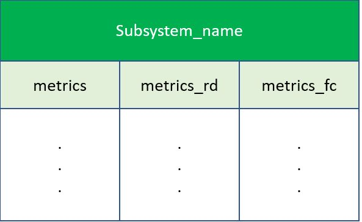

# Datagen Helm Chart

**Datagen : helm repository**

This repository represents the official helm repository of the [datagen-prod image](https://harbor1.cloud.vm/harbor/projects/2/repositories/datagen-prod/artifacts-tab) and is therefore available for download from the [jfrog](http://artifactory.cloud.vm:30238/ui/repos/tree/General/helm-local) artifactory as datagen-helm-1.0.0-stable

This version like all official helm versions is characterized by the "stable" flag indicating that this helm package has been opportunately tested in development environments and therefore is usable and customizable through [argocd](https://argo-cd.readthedocs.io/en/stable/) application or applicationset

**Datagen : Helm Configuration**

  | Parameter            | Description | Default  |
  |--------------------|--------------|------------------------|
  | subsystemsList |describes the set of subsystems taken from the Mosquitto topics to which the datagen shall subscribe in order to reorganize data ( it is necessary that this list matches with the list of subsystems of the [aqi-scryper](http://gitea.cloud.vm/HELM-PACKAGES/aqi-scryper-helm/src/branch/master/README.md) and [owm-scryper](http://gitea.cloud.vm/HELM-PACKAGES/owm-scryper-helm/src/branch/main/README.md) , so that the datagen can correctly receive the data ) | ` Rome,Milan`       | 
   | mosquittoHostname | it represents the hostname of the mosquitto service on which to publish messages containing the related data | `mosquitto-svc`       | 
  |mosquittoPort  | it represents the port of the mosquitto service on which to subscribe to receive the messages containing the data | ` 1883 `        | 
  | mosquittoTopics  | it represents the mosquitto topics on which to subscribe to receive the messages containing the data | ` # `        | 
  | mosquittoTags  | describes the mosquitto tags that the datagen considers as metadata when it writes them within the influxdb | `lat,lon `        | 
  | influxdbHostname  | it represents the hostname of the influxdb service on which the datagen will go to write the data after their restructuring| `influxdb `        | 
  | influxdbPort  | it represents the port of the influxdb service on which the datagen will go to write the data after their restructuring| `8086 `        | 
  | influxdbUser  | it represents the User Account of the influxdb service on which the datagen will access to write the data after their restructuring| `admin `        | 
  | influxdbPassword  | it represents the password of the influxdb service on which the datagen will access to write the data after their restructuring| `pwd `        | 
  | fullnameOverride  | Provide a name to substitute for the full names of Aqi-scryper resources    | ` `        |
  | nodeSelector  |specifies the node within the cluster where the application will be deployed    | `{}`        |

  
  **Datagen : General Information**

  the datagen is a Python script that has the task of reorganizing the data on  received via a mqtt subscription protocol to the mosquitto topics into a hierarchical structure , within the time-series database [influxdb](http://gitea.cloud.vm/HELM-PACKAGES/influxdb1-helm/src/branch/master/README.md) ,  that is appropriate to the forecasting analytics enforced by OWL. 
As can be seen in the figure below the data structure presents a database for each subsystem within which there will be a table for unelaborated metrics , a table for resemplated metrics, and a last one with the metrics produced by the forecasting analytics.

**influxdb data structure produced by datagen**

| 