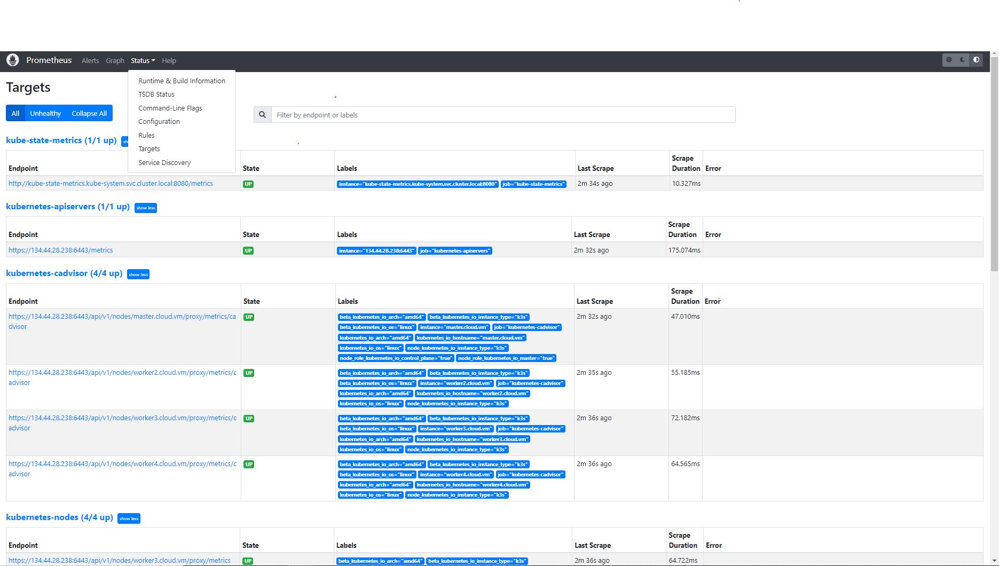

# Prometheus Helm Chart

This repository represents the official helm repository of the [prometheus-image](https://registry.hub.docker.com/r/prom/prometheus#!) and is therefore available for download from the [jfrog artifactory](http://134.44.28.237:30238/artifactory/helm-local) as **prometheus:0.1.0-official** 

This version like all official helm versions is characterized by the **"official"** flag indicating that this helm package has been ooportunately tested in development environments and therefore is usable and customizable through [argocd](https://argo-cd.readthedocs.io/en/stable/) application or applicationset 

## Prerequisites

- Helm v2 or later
- Kubernetes 1.4+
- (Optional) PersistentVolume (PV) provisioner support in the underlying infrastructure

## Helm Configuration

The following table lists configurable parameters, their descriptions, and their default values stored in `values.yaml`.

  | Parameter            | Description | Default  |
  |--------------------|--------------|------------------------|
    | image.repository | Image repository url | prom/prometheus |
| image.tag | Image tag | latest |
| image.pullPolicy | Image pull policy | Always |
  | prometheus.service.type | Kubernetes service type of Prometheus  | `ClusterIP`       | 
  | prometheus.service.nodePort  | kubernetes service nodeport of Prometheus    | ` `        | 
  | fullnameOverride  | Provide a name to substitute for the full names of prometheus resources   | ` `        | 
  | config.cluster  | Provide a the ip-address of kubernetes master of related cluster to substitute for redirect to the cluster destination of prometheus resources    | `192.192.192.191.6443 `        | 

**General information**

Prometheus is a high-scalable open-source monitoring framework. It provides out-of-the-box monitoring capabilities for the Kubernetes container orchestration platform.

The functionalities of prometheus are essentially based on few key points : 

- Metric Collection: Prometheus uses the pull model to retrieve metrics over HTTP. There is an option to push metrics to Prometheus using Pushgateway for use cases where Prometheus cannot Scrape the metrics. One such example is collecting custom metrics from short-lived kubernetes jobs & Cronjobs

- Metric Endpoint: The systems that you want to monitor using Prometheus should expose the metrics on an /metrics endpoint. Prometheus uses this endpoint to pull the metrics in regular intervals.

- PromQL: Prometheus comes with PromQL, a very flexible query language that can be used to query the metrics in the Prometheus dashboard. Also, the PromQL query will be used by Prometheus UI and Grafana to visualize metrics.

- Prometheus Exporters: Exporters are libraries which converts existing metric from third-party apps to Prometheus metrics format. There are many official and community Prometheus exporters . One example is, Prometheus node exporter. It exposes all Linux system-level metrics in Prometheus format.

- TSDB (time-series database): Prometheus uses TSDB for storing all the data efficiently. By default, all the data gets stored locally. However, to avoid single point of failure, there are options to integrate remote storage for Prometheus TSDB.

Prometheus scrape resources and capabilities.

- kubernetes-apiservers: It gets all the metrics from the API servers.

- kubernetes-nodes: It collects all the kubernetes node metrics.

- kubernetes-pods: All the pod metrics get discovered if the pod metadata is annotated with prometheus.io/scrape and prometheus.io/port annotations.

- kubernetes-cadvisor: Collects all cAdvisor metrics derived fro containers metrics.

- kubernetes-service-endpoints: All the Service endpoints are scrapped if the service metadata is annotated with prometheus.io/scrape and prometheus.io/port annotations. It can be used for black-box monitoring.

The correct use of prometheus requires the following basic components:

- Node exporter  

Node exporter is an official Prometheus exporter for capturing all the Linux system-related metrics and format them so that prometheus receives them correctly. It collects all the hardware and Operating System level metrics that are exposed by the kernel.

You can use the node exporter to collect the system metrics from all your Linux systems. Check this article on node monitoring using [node-exporter](https://devopscube.com/monitor-linux-servers-prometheus-node-exporter/)

- Kube state metrics:
Kube State metrics is a service that talks to the Kubernetes API server to get all the details about all the API objects like deployments, pods, daemonsets, Statefulsets, etc.

Primarily it produces metrics in Prometheus format with the stability as the Kubernetes API. Overall it provides kubernetes objects & resources metrics that you cannot get directly from native Kubernetes monitoring components.

Kube state metrics service exposes all the metrics on /metrics URI. Prometheus can scrape all the metrics exposed by Kube state metrics.

Following are some of the important metrics you can get from Kube state metrics.

- Node status, node capacity (CPU and memory)
- Replica-set compliance (desired/available/unavailable/updated status of replicas per deployment)
- Pod status (waiting, running, ready, etc)
- Ingress metrics
- PV, PVC metrics
- Daemonset & Statefulset metrics.
- Resource requests and limits.
- Job & Cronjob metrics

Kube state metrics is available as a public docker image. You will have to deploy the following Kubernetes objects for Kube state metrics to work.

- A Service Account
- Cluster Role – For kube state metrics to access all the Kubernetes API objects.
- Cluster Role Binding – Binds the service account with the cluster role.
- Kube State Metrics Deployment
- Service – To expose the metrics

After installing and configuring prometheus, kube state metrics and the associated node exporter, all components should be up and running as shown in the figureon prometheus dahoboard (create a nodeport on prometheus service to visualize prometheus dashboard)

For other Information on commands click on [Setup of Prometheus on Kubernetes](https://devopscube.com/setup-prometheus-monitoring-on-kubernetes/)

# License

### © Copyright 2022 Hewlett Packard Enterprise Development LP

