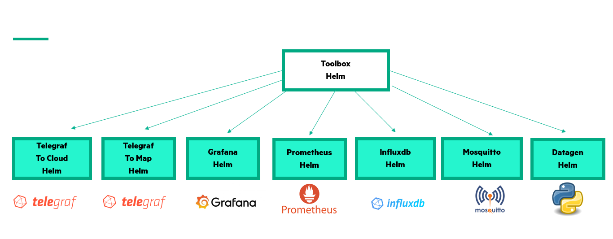

 #  Toolbox Helm Chart

This repository represents the official helm repository of the toolbox which collects all the basic components of the solution that are therefore predefined and it is therefore available for download from the [jfrog](http://artifactory.cloud.vm:30238/ui/repos/tree/General/helm-local) artifactory as toolbox-helm-0.1.0-official

This version like all official helm versions is characterized by the **"official"** flag indicating that this helm package has been opportunately tested in development environments and therefore is usable and customizable through [argocd](https://argo-cd.readthedocs.io/en/stable/) application or applicationset

##

## Dependencies 
The toolbox bundle adopts for its use  various helm packages that it brings in as dependencies declared within its chart, as listed  and shown below:

  - [Telegraf to Map](http://gitea.cloud.vm/HELM-PACKAGES/telegrafttomap-helm)
  - [Telegraf to Cloud](http://gitea.cloud.vm/HELM/forecasting-helm)
  - [Grafana](http://gitea.cloud.vm/HELM-PACKAGES/grafana-helm)
  - [Prometheus](http://gitea.cloud.vm/HELM-PACKAGES/prometheus-helm)
  - [Mosquitto](http://gitea.cloud.vm/HELM-PACKAGES/mosquitto-helm)
  - [Datagen](http://gitea.cloud.vm/HELM-PACKAGES/datagen-helm)
  - [Influxdb](http://gitea.cloud.vm/HELM-PACKAGES/influxdb-helm)

  The toolbox helm chart include also a [nfs provisioner](http://cloud.vm:30082/ui/repos/tree/General/helm-local%2Fpostgresql-11.1.26.tgz)

  

# License

### © Copyright 2022 Hewlett Packard Enterprise Development LP